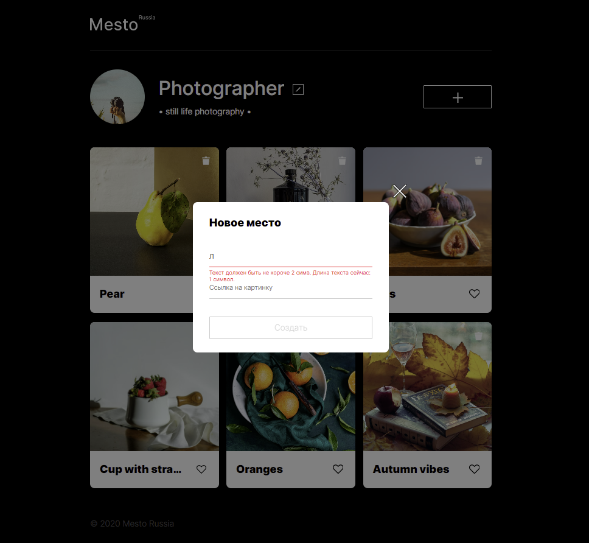
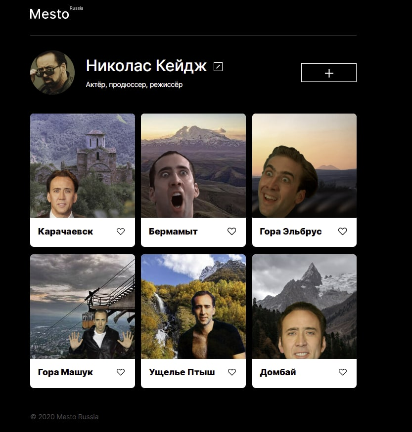

# Проект: Место

### Обзор

---

"Место" - это интерактивная страница для обмена фотографиями. Проект выполнется в рамках обучения на курсе "Веб-разработчик" Яндекс Практикум.

### Функционал

---

- Изменение имени и описания профиля через форму редактирования данных
- Создание и удаление карточек с фотографиями
- Постановка и снятие лайков
- Открытие попапа с масштабированным фото краточки
- Валидация форм

### О способе реализации проекта

---

Веб-страница создана с использованием _html_, _css_, _Javascript_. Файловая структура организована в соответствии с БЭМ-методологией. В проекте были использованы _flex_, _grid_, _media-запросы_ и др.

### **Как посмотреть**

---

- [Ссылка на проект на **GitHub Pages**](https://julbrn.github.io/mesto/)
- [Макет Figma](https://www.figma.com/file/2cn9N9jSkmxD84oJik7xL7/JavaScript.-Sprint-4?node-id=0%3A1)
